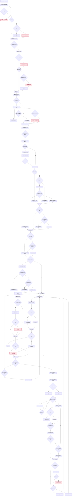

# 选题采集与研究 Agent｜流程图

这张流程图对应“选题采集与研究 Agent”，用于检查从需求解析、信息采集、核验筛选、深度研究到偏好更新与日报反馈的完整执行链路、判断分支和人工兜底点。

```mermaid
flowchart TD
    A[接收用户请求或每日定时触发] --> B[解析话题 关键词 时间范围及本轮偏好]
    B --> C{关注话题和关键词是否明确?}

    C -- 否 --> H1[人工兜底：确认关注话题和搜索范围]
    H1 --> B
    C -- 是 --> D{时间范围是否明确?}

    D -- 是 --> F[读取最新版 Selection Policy]
    D -- 否 --> E{24小时内是否执行过同类采集?}
    E -- 是 --> E1[默认重新覆盖完整最近24小时]
    E1 --> F
    E -- 否 --> H2[人工兜底：确认本轮时间范围]
    H2 --> F

    F --> G{本轮要求是否与已有偏好冲突?}
    G -- 否 --> J[生成本轮采集计划]
    G -- 是 --> G1[本轮明确要求优先]
    G1 --> G2{新要求的有效范围是否明确?}
    G2 -- 是 --> G3{是否为全局偏好?}
    G2 -- 否 --> H3[人工兜底：确认仅本次或全局有效]
    H3 --> G3
    G3 -- 否 --> J
    G3 -- 是 --> G4{新旧规则适用边界是否清晰?}
    G4 -- 是 --> G5[更新 Selection Policy 并保存历史版本]
    G5 --> J
    G4 -- 否 --> H4[人工兜底：确认新旧规则保留 替换或适用条件]
    H4 --> G5

    J --> K[配置必查来源 通用搜索及专项采集能力]
    K --> L{必查来源是否全部可访问?}
    L -- 是 --> P[遍历基础来源并执行广泛采集]
    L -- 否 --> M[寻找替代渠道或新的采集能力]
    M --> N{替代能力是否可靠且安全?}
    N -- 否 --> N1[弃用风险能力并继续寻找替代方案]
    N1 --> M
    N -- 是 --> N2[验证后纳入本轮采集]
    N2 --> P
    M --> O{重要渠道缺口是否仍无法弥补?}
    O -- 是 --> H5[人工兜底：汇报渠道缺口并请求协助]
    H5 --> P
    O -- 否 --> P

    P --> Q[使用通用搜索和至少一种专项能力补充采集]
    Q --> R{是否仍发现新的重要事件或独立角度?}
    R -- 是 --> P
    R -- 否 --> S[形成全部候选信息集合 不设数量上限]

    S --> T{内容是否可正常读取?}
    T -- 否 --> T1[标记待补查并记录失败原因]
    T1 --> T2[寻找官方来源或可信替代报道]
    T2 --> T3{是否找到可用替代来源?}
    T3 -- 是 --> U[核验事实和来源状态]
    T3 -- 否 --> T4[保留待补查线索 不写成确定事实]
    T4 --> V
    T -- 是 --> U

    U --> U1{是否存在官方原文?}
    U1 -- 是 --> U2[确认官方发布事件 宣传性结论标记为官方自述]
    U1 -- 否 --> U3{是否有长期可信的权威媒体完整报道?}
    U3 -- 是 --> U4[标记为媒体报道并通过候选核验]
    U3 -- 否 --> U5[标记为单源报道或待补查]
    U5 --> U6{是否符合三个核心方向之一?}
    U6 -- 是 --> U7[进入候选并显著标记待进一步核验]
    U6 -- 否 --> V
    U2 --> W
    U4 --> W
    U7 --> W

    W --> X{可信来源之间是否存在明显冲突?}
    X -- 否 --> V[执行事件去重与合并]
    X -- 是 --> X1{争议是否具备热点或重要主体价值?}
    X1 -- 是 --> X2[保留为争议选题并同时呈现各方说法]
    X2 --> V
    X1 -- 否 --> X3[转为观察或淘汰]
    X3 --> V

    V --> Y{是否为同一主体 同一事件 同一核心事实?}
    Y -- 是 --> Y1[合并记录并汇总全部发现渠道 数据和链接]
    Y -- 否 --> Z{是否形成独立核心结论 受众或内容目的?}
    Z -- 是 --> Z1[拆分为独立候选选题]
    Z -- 否 --> Y1
    Y1 --> AA
    Z1 --> AA

    AA{是否符合三个核心选题方向中的任意一个?}
    AA -- 否 --> AB[标记淘汰并保留记录]
    AA -- 是 --> AC[判断热点价值 长期价值及内容方向]

    AC --> AD{是否为高热度但业务关联较弱?}
    AD -- 是 --> AD1[为账号曝光保留并进入待筛选]
    AD -- 否 --> AE{是否高度相关但当前热度较低?}
    AE -- 是 --> AE1[按长期价值 信息差 行业影响或业务定位保留]
    AE -- 否 --> AE2[按正常选题价值继续判断]
    AD1 --> AF
    AE1 --> AF
    AE2 --> AF

    AF[生成粗略标题及选题方向与核心观点] --> AG[建立完整候选记录]
    AG --> AH{所有候选必填字段是否完整?}
    AH -- 否 --> AH1[自动补齐来源 分类 时间 状态和关联链接]
    AH1 --> AH2{是否仍存在无法补齐的关键字段?}
    AH2 -- 否 --> AI[进入二次筛选]
    AH2 -- 是 --> H6[人工兜底：确认无法补齐的关键记录]
    H6 --> AI
    AH -- 是 --> AI

    AI --> AJ{是否已进入 Agent 自主筛选模式?}
    AJ -- 否 --> H7[人工环节：完成采用 淘汰 排序和方向校准]
    H7 --> AK
    AJ -- 是 --> AK[Agent 执行二次筛选]

    AK --> AL{是否满足任意一项采用条件?}
    AL -- 是 --> AM[标记已采用并分配永久唯一母选题ID]
    AL -- 否 --> AN{是否满足任意一项淘汰条件?}
    AN -- 是 --> AB
    AN -- 否 --> AO[保持待筛选或进入观察]

    AM --> AP[在独立排期队列中计算生产优先级]
    AP --> AQ{是否为高时效热点或人物选题?}
    AQ -- 是 --> AQ1[优先安排并持续检查发布窗口]
    AQ -- 否 --> AQ2[按长期价值和业务优先级安排]
    AQ1 --> AR
    AQ2 --> AR

    AR{是否进入计划制作日前3天?}
    AR -- 否 --> AS[保持已采用并等待排期]
    AS --> AS1{时效是否已经失效?}
    AS1 -- 是 --> AB
    AS1 -- 否 --> AR
    AR -- 是 --> AT[围绕受众核心问题启动深度研究]

    AT --> AU{是否满足任意一项标准研究包条件?}
    AU -- 是 --> AU1[扩展官方资料 媒体讨论 背景 数据 案例及素材]
    AU -- 否 --> AU2[完成最低研究包]
    AU1 --> AV
    AU2 --> AV

    AV{是否达到任意一项研究停止条件?}
    AV -- 否 --> AT
    AV -- 是 --> AW[生成独立研究资料并回填精简核心观点]

    AW --> AX{研究资料是否超过制作日前3天?}
    AX -- 否 --> AY[执行交付质量检查]
    AX -- 是 --> AX1{核心事实或背景是否发生重大变化?}
    AX1 -- 是 --> AT
    AX1 -- 否 --> AX2[补查最近3天增量信息并更新研究包]
    AX2 --> AY

    AY --> AZ{是否存在方向模糊 来源无效或重要信息未更新?}
    AZ -- 否 --> BA{核心事实是否仍然成立?}
    AZ -- 是 --> AZ1[Agent 自主补查和修正]
    AZ1 --> AZ2{问题是否已经解决?}
    AZ2 -- 是 --> BA
    AZ2 -- 否 --> H8[人工兜底：连续补查失败 请求协助]
    H8 --> BA

    BA -- 否 --> BB[直接淘汰并保留原因及版本历史]
    BA -- 是 --> BC[交付可制作的选题及研究资料]

    AB --> BD[记录状态变化和淘汰原因]
    AO --> BD
    BB --> BD
    BC --> BD

    BD --> BE[汇总当天工作 指标 异常和优先选题]
    BE --> BF{当天是否收到新的有效反馈?}
    BF -- 是 --> BG[立即更新 Selection Policy 并保存完整版本记录]
    BF -- 否 --> BH[日报注明暂无反馈]
    BG --> BI[生成每日汇报]
    BH --> BI

    BI --> BJ{自主模式是否出现质量退化信号?}
    BJ -- 否 --> BK[本轮执行完成]
    BJ -- 是 --> BL[回滚 Selection Policy 并退回人工筛选模式]
    BL --> H7

    classDef human fill:#FFE4E6,stroke:#BE123C,color:#881337,stroke-width:2px;
    class H1,H2,H3,H4,H5,H6,H7,H8 human;
```
